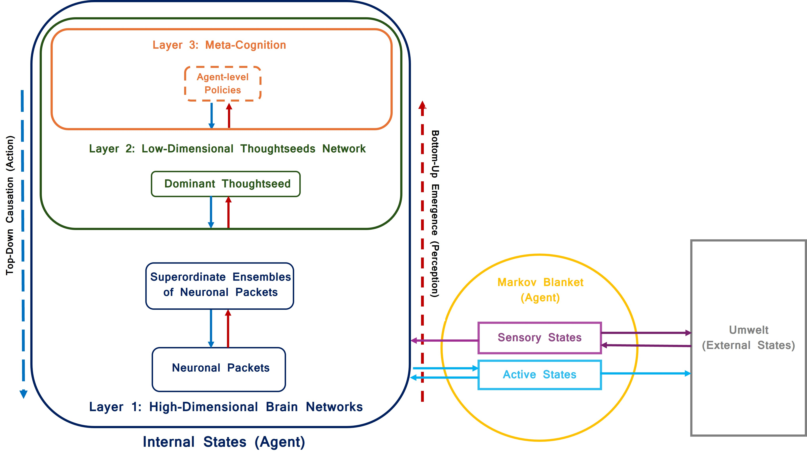
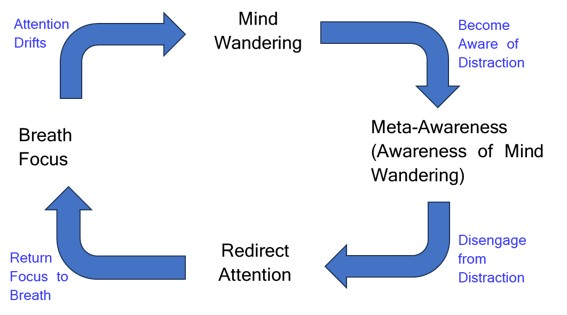

# Enactive Inference Model of Neurocomputational Phenomenology for Studying Meditative States 

## Architecture


The system is composed of three nested differentiable layers: 

1.  **Layer 1 **: `layer1_brain_networks.py`
    - Stochastic Differential Equation (SDE) modeling neural dynamics.
    - Receives `agent_bias` from Layer 2.

2.  **Layer 2 **: `layer2_gnw_bottleneck.py`
    - Global Workspace Bottleneck.
    - Generates `agent_bias` (Action).
    - Performs Precision-Weighted Inference (Perception).

3.  **Layer 3 **: `layer3_phenomenological_monitor.py`
    - Meta-Cognitive Monitor.
    - Computes Meta-VFE.

This repository contains the **Differentiable Hierarchical Engine ** for identifying and simulating the control-theoretic dynamics of meditation.



## Key Features (v3.2)

### 1. Control Theoretic Architecture
Move beyond passive predictive coding. The engine now implements **Active Control**:
- **Continuous Top-Down Steering**: The Agent (Layer 2) calculates a continuous `agent_bias` vector based on its intent and actively steers the Biology (Layer 1).
- **Precision-Weighted Updates**: The Agent dynamically balances "Trust in Self" vs "Trust in Senses" using a Kalman-like update rule driven by Meta-Awareness.
- **Guaranteed Stability**: Layer 1 uses **Automatic Spectral Scaling** to enforce mathematical stability regardless of parameter choices.

### 2. Biological Rigor
Strict adherence to neuroscientific profiles for:
- **Breath Focus**: Tonic maintenance (High DAN/FPN, Low VAN).
- **Mind Wandering**: Default mode dominance (High DMN).
- **Meta-Awareness**: Salience spike (Peak VAN).
- **Redirect**: Phasic control burst (Peak DAN/FPN).

### 3. Deep Learning "Parsimony"
Implements **Contrastive Regularization** during training to force the agent to learn high-contrast, logically distinct internal states even from noisy data.


## Workflow

### 1. Training (Learn Attractors)
Learns stable internal models (priors) from the biological dynamics, enforcing contrastive separation.
```bash
python run/run_training.py
```

### 2. Simulation (Active Control)
Runs the full Active Inference loop where the Agent actively steers the Biology using the learned priors.
```bash
python run/run_simulation.py
```

### 3. Visualization
Generates plots showing the DMN-DAN gap, Phase Transitions, and Free Energy landscapes.
```bash
python run/plot_simulation.py
```

## Documentation

