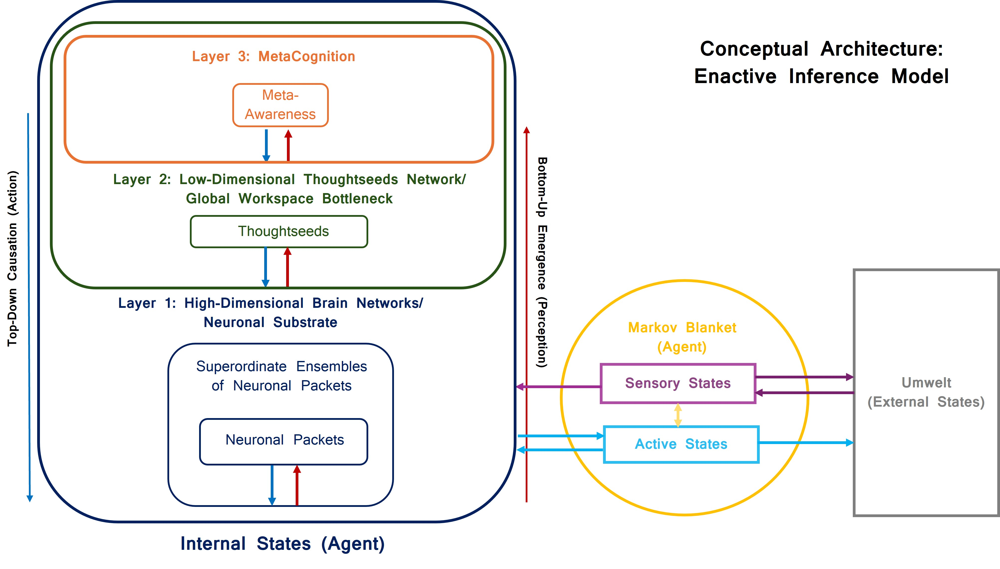

# Enactive Inference Model

---

## Architecture
 
```
+--------------------------------------------------------------+
| Layer 3: Metacognitive Monitor                               |
| - Meta-awareness: gated divergence (policy evidence vs habit) |
| - Selects policy posterior q(pi); modulates policy precision  |
+------------------------------+-------------------------------+
               | Markov Blanket L2<->L3
               | Sensory: policy evidence G(pi), state belief
               | Active:  sensory precision pi_x
+------------------------------v-------------------------------+
| Layer 2: Attentional Agent (Thoughtseeds)                    |
| - Compresses neural dynamics into 5 thoughtseeds             |
| - Encoder/decoder + forward model f(x,z)                     |
| - Evaluates expected free energy G(pi); passes evidence to L3 |
| - Sensory precision from forward surprisal (exp form)         |
+------------------------------+-------------------------------+
               | Markov Blanket L1<->L2
               | Sensory: s_t, x_t, dwell_progress d_t
               | Active:  mu_x, transition_drive u_t, policy_state_probs
+------------------------------v-------------------------------+
| Layer 1: Neural Generative Process (MVOU)                    |
| - 4 brain networks (DMN, VAN, DAN, FPN)                      |
| - 4 meditation states (BF, MW, MA, RA)                       |
| - Multivariate Ornstein-Uhlenbeck dynamics                   |
| - Attractor mixing: mu <- (1-m_t)mu + m_t mu_x               |
+--------------------------------------------------------------+
```

## Summary
- States: BF, MW, MA, RA (focused attention cycle)
- Networks: DMN, VAN, DAN, FPN
- Thoughtseeds: attend_breath, pain_discomfort, pending_tasks, aha_moment, equanimity
- Two-phase protocol: learning (variational EM) then inference-only simulation; figures use the last 2,000 steps

---

## Installation

```bash
pip install -r requirements.txt
```

**Requirements:**
- Python 3.9+
- See `requirements.txt`
- Runs on CPU only; no GPU required or used.

---

## Usage

### Run Full Pipeline (Learning + Simulation + Plots)

```bash
python run_enactive_inference.py run
```

This runs a **two-phase protocol** per phenotype: (1) **Learning phase**: variational EM for 10,000 timesteps to fit encoder, decoder, forward model, and habit prior; (2) **Simulation phase**: inference-only for 10,000 timesteps with frozen parameters. Results are saved to `data/` and all plots are generated in `figures/`.

### Generate Plots from Existing Data

```bash
python run_enactive_inference.py plot
```

Generates publication-quality figures from saved results. When available, plots use **simulation results** (inference-only) rather than training results; otherwise falls back to training results.

---

## Output

### Results (saved to `data/`)
- `training_results_expert_seed42.json` / `training_results_novice_seed42.json` — learning-phase trajectories
- `simulation_results_expert_seed42.json` / `simulation_results_novice_seed42.json` — inference-only trajectories (used for figures when available)

Each contains: state/network/thoughtseed histories, free energy, meta-awareness, and transition statistics.

### Plots (generated in `figures/`)
**Convergence (FigS1):**
- `FigS1_Convergence_Expert.pdf`, `FigS1_Convergence_Novice.pdf` — learning vs inference-only stability, cumulative state occupancy

**Comparison (Fig 3):**
- `fig3a.pdf` — Network activation profiles across states (Expert vs Novice)
- `fig3b.pdf` — Dwell times per state (timesteps)
- `fig3c.pdf` — State transition probability matrices

**Hierarchy (Fig 4 & 6):**
- `fig4a.pdf`, `fig4b.pdf` — 3-layer hierarchical dynamics (L3 meta-awareness, L2 dominant thoughtseed, L1 networks)
- `fig6a.pdf`, `fig6b.pdf` — Same with continuous thoughtseed traces

**State space (Fig 5):**
- `fig5.pdf` — PCA trajectories (L2 thoughtseeds + L1 networks)

**Tail window:** Plots and transition/dwell statistics use the last 2,000 steps (converged regime).

---

## Mechanics (short)
- Markov blankets: L2↔L3 carries state belief and policy evidence upward and sensory precision downward; policy posterior is returned directly from L3 to L2.
- VFE: `F(z) = pi_x * ||x - decode(z)||^2 + ||z - mu_z(s)||^2`
- Policy posterior: `q(pi) = softmax(log E(pi) + (1-m_t) * lbar_pi - m_t * r_t * G_tilde(pi))`
- VI refinement: mismatch-triggered; step count scales with uncertainty `(1 - precision)` up to `VI_STEPS`

---

## File Structure

```
.
+-- run_enactive_inference.py  # Main entry point (run | plot)
+-- model/                     # Core logic
|   +-- training_loop.py       # MeditationTrainer (EM, BPTT, simulate)
|   +-- phenotype.py           # Expert/novice phenotype definitions
|   +-- l1_generative_process.py  # Layer1Process (MVOU dynamics)
|   +-- l2_recognition.py         # Layer2Agent (encoder/decoder/forward model)
|   +-- l3_metacognition.py       # Layer3Monitor (meta-awareness, policy selection)
|   +-- markov_blankets.py        # Markov blanket interfaces
+-- utils/
|   +-- config.py              # Constants, priors, BPTT_STEPS, TAIL_STEPS, etc.
|   +-- math_utils.py          # Tensor/math operations
+-- data/                      # Training and simulation results (JSON)
+-- figures/                   # Generated figures (PDF)
+-- scripts/                   # Utilities (e.g. extract_results_stats.py)
+-- viz/                       # Plotting
    +-- analysis.py, analysis_utils.py
    +-- attractors.py, convergence.py, diagnostics.py
    +-- hierarchy.py, radar_plot.py, plotting_utils.py
```

---

## Configuration

Edit `utils/config.py` to modify:
- Network/state parameters (Theta matrices, mu attractors)
- Thoughtseed priors (THOUGHTSEED_STATE_PRIORS)
- Dwell ranges (DWELL_TIMES) and transition priors (STATE_TRANSITION_PROBS)
- Learning rates (0.01 novice, 0.02 expert)
- Process noise (NOISE_LEVEL), BPTT_STEPS (25), TAIL_STEPS (2000)

---

## Reproducibility

Fixed random seed (42) ensures identical results across runs. Training is stochastic (e.g., MW dominance sampling), but fully seed-controlled.

---

## Citation

If you use this model in your research:

```
@article{enactive_inference_thoughtseeds_2026,
  author = {Kavi, P. C. and Friedman, D. A. and Patow, G.},
  title = {Thoughtseeds as Latent Causes: A Computational Phenomenology of Focused-Attention Meditation},
  journal = {Proc. R. Soc. A},
  year = {2026}
}
```
This repository is a significant step forward in enhancing the Thoughtseeds Framework for Enactive Inference. It builds upon the foundational work of the Thoughtseeds Framework, adapting code snippets from below:

  https://github.com/prakash-kavi/thoughtseeds_vipassana 
  
  https://github.com/prakash-kavi/viapssana_ts2  
  
  https://github.com/prakash-kavi/aif_iwai2025_thoughtseeds
